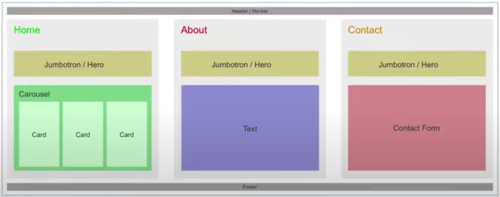

# React-Portfolio

Now that I have worked with React and have multiple projects to share, I'm updating my portfolio and other materials using React.

## Wireframe

## Updates Made

- Updated portfolio featuring 6 total projects
- Use React
- A Header component that appears on multiple pages
- A single Project component that will be used multiple times on a single page
- Navigation with React Router, dynamic rendering, or another third part router
- A Footer component that appears on multiple pages
- Update GitHub profile with pinned repositories featuring those same projects

## Technology

- React
- React Router
- React Spring
- SendGrid

## Preview
[Deployed Link!](https://vt-react-portfolio.herokuapp.com/)

